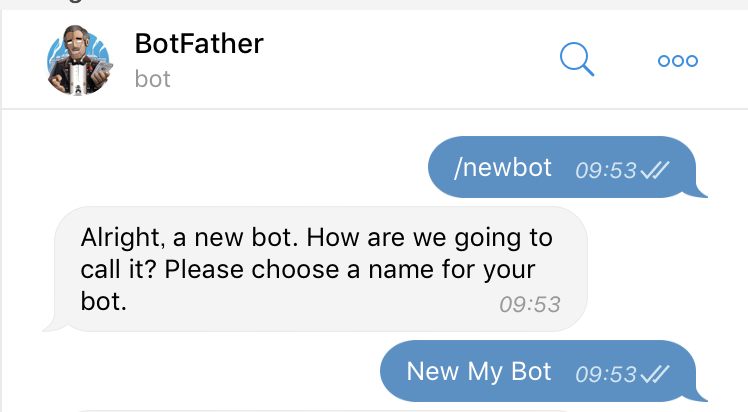
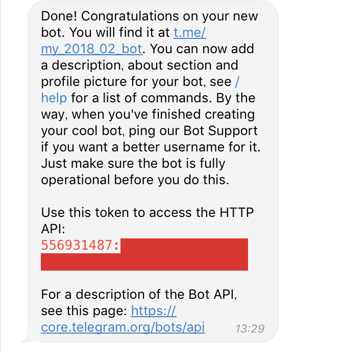
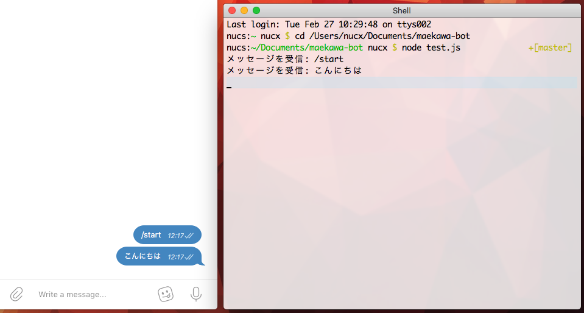

Node.js + Express + node-telegram-bot-apiでbotを制作します．実際に運用しているbotのソースコードは[GitHub](https://github.com/neetshin/minazuki-bot)で公開していますのでご参考までにどうぞ．

## Botアカウントの登録

はじめに，Telegram APIを利用するためのbotを登録します．Twitterなどとは異なり電話番号から登録する普通のアカウントとは別のbotアカウントを作成して，そちらにAPIを介してアクセスします．あくまでもbot専用のAPIというわけです．

Telegramのオフィシャルbotである[@botfather](https://t.me/botfather)に`/newbot`と送信することでbotの登録が開始できます．はじめにbotの表示名を設定しますが，こちらは後から変更可能です．
　


次に，botのユーザー名（@usernameの形式のもの）を設定します．こちらは残念ながら後から変更が出来ない上，末尾が`bot`で終了する必要があるため注意してください．


Botアカウントが登録できると，最後にAPIにアクセスするためのトークンが送られてきます．`/token`と送信することで再発行も可能ですが，安全性のために適切に保存してください．



デフォルトではbotは`/`から始まるメッセージにしかアクセス出来ないようになっていますが，これは`/setprivacy`を利用することで無効化できます．必要であれば設定してください．


## APIのインストール
Axiosなどから直接APIにアクセスすることも可能ですが，npmで[node-telegram-bot-api](https://github.com/yagop/node-telegram-bot-api)という優れたライブラリが公開されているのでこちらを利用します．

**npm:**

```sh
npm install --save node-telegram-bot-api
```

**yarn:**

```sh
yarn add node-telegram-bot-api
```

## APIの利用: メッセージを受信する
トークンを取得し，ライブラリをインストールできたら早速botを動かし始めることができます．以下のコードを参考にメッセージを受信したらコンソールに受信したテキストを表示するbotを作ります．

```bot.js
const TelegramBot = require('node-telegram-bot-api');

// トークンを指定してインスタンス化
const bot = new TelegramBot('ここにアクセストークンを指定', { polling: true });

// Messageを受け取ったら実行
bot.on('message', (message) => {
	const { text } = message;
	console.log(`メッセージを受信: ${text}`);
});
```

メッセージの受信は`on('message')`で行えます．`on()`メソッドでは第二引数に受信するイベントの種類を指定でき，メッセージ以外にも様々なものがあるので試してみるといいかもしれません．イベントの一覧は[こちらのドキュメント](https://github.com/yagop/node-telegram-bot-api/blob/master/doc/usage.md#events)で確認できます

そして，`on('message')`で受信できる[`Message`エンティティ](https://core.telegram.org/bots/api#message)は，`text`に生のテキストが格納されているので，それを`console.log`で出力することができます．

　Botを起動

```sh
node bot.js
```

#### 結果


## APIの利用: メッセージを送信する
先程のコードを少し変更し，今度は受け取ったテキストをそのまま返信するbotを作ります．botからメッセージを送信するためには`sendMessage()`というメソッドを利用します．以下が例です

```javascript
const TelegramBot = require('node-telegram-bot-api');

// トークンを指定してインスタンス化
const bot = new TelegramBot('ここにアクセストークンを指定', { polling: true });

// Messageを受け取ったら実行
bot.on('message', (message) => {
	const { chat, text } = message;
	bot.sendMessage(chat.id, `メッセージを受信: ${text}`);
});
```

尚，利用可能な他のメソッドは[Telegramの公式ドキュメント](https://core.telegram.org/bots/api#available-methods)で詳しく解説されているのでカスタマイズしてみると面白いと思います．

#### 結果


## Webhookの利用
Webhookを利用することも可能なので方法をご紹介します．上記のコードは全てpollingでイベントを受信していましたが，ここはExpressを使って受信用のアプリケーションを構築します．

まず追加で必要なライブラリをインストールします．
　
**npm:**　

```sh
npm install --save express body-parser
```

**yarn:**

```sh
yarn add express body-parser
```
　
### 証明書の発行
Webhookでのイベント受信には自己署名証明書（いわゆるオレオレ証明書）の発行が必要なのでOpenSSLを用いて発行します．Let's encryptなどで発行したものでは正常にリクエストが送られてこないので注意してください．

```sh
openssl req -newkey rsa:2048 -sha256 -nodes -keyout key.pem -x509 -days 365 -out cert.pem
```

### サンプル
Webhookでは，イベントが発生する度にTelegramのサーバーからPOSTリクエストが送信されるため，それをExpressで受信してbotに受け渡す必要があります．

以下のコードを参考に，ExpressとWebhookでbotを起動します．`app.listen()`で引数に指定したポート番号（例では8080）にリクエストが送信されるので，Webサーバー側で適切にプロキシの設定を行うことで運用が可能です．

```javascript
const express     = require('express');
const bodyParser  = require('body-parser');
const TelegramBot = require('node-telegram-bot-api');

// トークンを指定してインスタンス化
const token = 'ここにアクセストークンを指定';
const bot   = new TelegramBot(token);

// Expressを起動
const app = express();

app.use(bodyParser.json());

app.post(`/bot${token}`, (req, res) => {
  api.processUpdate(req.body);
  res.sendStatus(200);
});

app.listen(8080);

// SSLの証明書とcallback用のURIを指定してイベントの受信をWebhookに
bot.setWebHook(`https://あなたのドメイン/bot${token}`, {
  certificate: '公開鍵のpath/crt.pem',
});
```

## 参考
- [Telegram Bot API（Telegramの公式ドキュメント）](https://core.telegram.org/bots/api)
- [node-telegram-bot-api_api.md at master（ライブラリの解説ドキュメント）](https://github.com/yagop/node-telegram-bot-api/blob/master/doc/api.md)
- [node-telegram-bot-api_express.js at master（Webhook + Expressの設定例）](https://github.com/yagop/node-telegram-bot-api/blob/master/examples/webhook/express.js)
