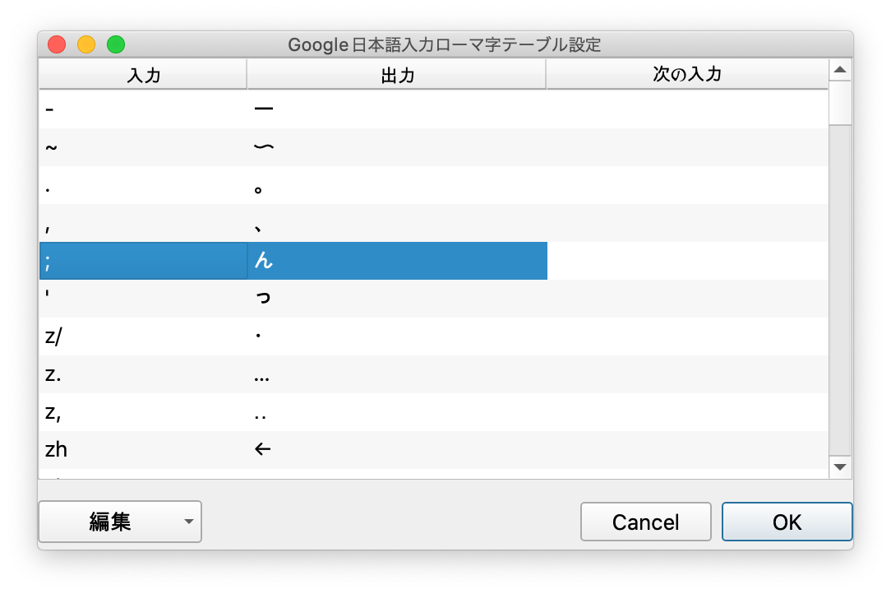

ボンゴレ・ロッソ ← 昨日の夜ごはん

## ローマ字入力の「ん」、扱いづらい説

日本語の音節は CV (子音+母音) あるいは V (母音) とその [二重母音](https://en.wikipedia.org/wiki/Diphthong) で構成されていて、例外的に子音 m、n、ŋ、ɴ を語頭以外でのみ使うことができます。

しかし、多くのネイティブスピーカーがこれを子音としてではなく音節として[^1]認識しているため、他の文字は全て母音を含んでいるのにも関わらず「ん」という母音を持たない文字が用意されています。

そして、あろうことかローマ字入力を発明した人はこの「ん」をヨーロッパ諸語の n と同等に入力できるようにしてしまったため、現在「ん」の入力には複雑なコンテキストがあります。

1. 直後が母音から始まる場合、n を 2 回タイプする （簡易: `ka nn i`）
2. 直後がナ行である場合、n を 2 回タイプする （館内: `ka nn nai`）
3. 直後がヤ行である場合、n を 2 回タイプする （今夜: `ko nn ya`）
4. 直後が母音でもナ行でもない場合、n を 1 回タイプする （関西: `ka n sai`）
5. 最後の音節の場合、 n を 2 回タイプする （寒天: `ka n te nn`）

確かにこの方法はアルファベットを入力する際の方法と互換性があるものの、n を 2 回入力する際に実際に 2 音節分「ん」と発音するわけではありませんし、同じ文字を入力しようとしているにも関わらず異なった方法を用いなければならないのは直感的ではないと思います。

## 改善策

以上の点を改善するため、ホームポジションで唯一 かな入力 に使われない`;`をタイプしたときに、`ん`と入力されるようにローマ字入力をリマップしました。

Google 日本語入力では、ローマ字入力のカスタマイズは _環境設定 > 一般 > キー設定_ から行えます。

この変更により、以下のような単語が効率的に入力できるようになります。

| 単語                 | 変更前           | 変更後         |
| :------------------- | :--------------- | :------------- |
| こんにちは           | konnnitiha       | ko;nitiha      |
| 延々と               | ennento          | e;e;to         |
| 感圧板               | kannatsubann     | ka;atsuba;     |
| 音韻                 | onninn           | o;i;           |
| そんなこんな         | sonnnakonnna     | so;nako;na     |
| アンエンタープライズ | annennta-puraizu | a;e;ta-puraizu |
| ウンウンオクチウム   | unnunnokutiumu   | u;u;okutiumu   |
| ヴァンアレン         | vannarenn        | va;are;        |

### 利点

- n を 2 回入力するのと別のキーを 2 回入力するのでは速度が大きく異る
- 次の音節が何かを確認しなくて良いので脳内メモリのガベージコレクションが楽

### 欠点

- 全角のセミコロンを入力できなくなる
- なれるまでに時間を要する

おわり。

[^1]: 厳密には音節ではなく「モーラ」（拍）という単位で数えられます。
