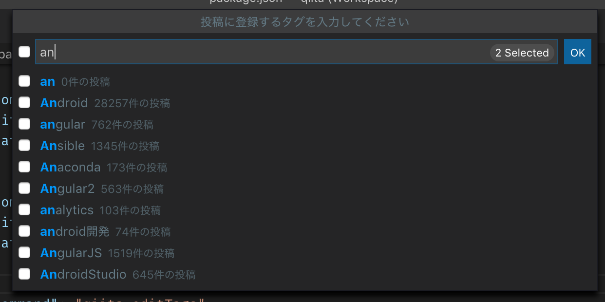

VSCodeで編集中のMarkdownファイルを一発でQiitaに公開できるスマートな拡張機能があればいいな〜と思ってGoogleで検索したら [こちらの記事](https://qiita.com/wenbose/items/3a4425f69b9eb2fe52c6) がヒットしたのですが、どうやら開発が滞ってしまっていたようで、同様のものを開発しても良いかをコメントでお尋ねしたところ[快諾してくださった](https://qiita.com/wenbose/items/3a4425f69b9eb2fe52c6#comment-324f27d5beac7e9d3052)ので公開してみました。

- [GitHub](https://github.com/neet/vscode-qiita) （★ください）
- [インストール](https://marketplace.visualstudio.com/items?itemName=Neetshin.vscode-qiita) （現時点ではプレビュー版です）

途中でTypeScriptの[コンパイラーのバグ](https://github.com/Microsoft/vscode-generator-code/issues/117)を踏んでデバッグできなくなって発狂しそうになりましたが、なんとか必要最低限の機能は実装できたので所感を書いておきます。

## Visual Studio Codeの拡張機能について
VSCodeの拡張機能は基本的にTypeScriptで実装できます。直接DOMの操作ができず、提供されたAPIの中で頑張らなくちゃいけない設計なので、はじめは覚えるのに苦労すると思いますが、やっているうちにだんだん良くできているのがわかってきたと思います。

### package.json
VSCodeのAPIでは、自作のコマンドやビュー領域を `package.json` に追記して設定するのですが、それらの設定が増えてくるにつれてどうしてもpackage.jsonも太ってしまうので見づらかったりタイポに気づかなかったりして大変でした。せっかくMS自家製の素晴らしい型システムがあるんだから.tsファイルから設定させてくれればいいのにとも思いましたが、それではダメだったのでしょうか...

### TreeDataProvider


TreeDataProviderとTreeItemというクラスをビュー領域に登録することでサイドバーにエクスプローラーっぽいものを作れました ([詳細](https://code.visualstudio.com/docs/extensionAPI/vscode-api#TreeItem))。アイテムがクリックされたら発火するコマンドを指定できるので、ビューが切り替わったときに呼ばれる関数で投稿を取得できるようにしておいて、クリックされたらローカルディレクトリにファイルを保存してユーザーのワークスペースにMarkdownが表示されるようになっています。

### InputBox/QuickPick
ユーザーからの入力を受け付ける方法はいくつかありましたが、一番かっこよかったQuickPickとInputBoxというAPIを利用しました。

InputBoxはその名の通りinputするboxで、ユーザーが入力を変更した際、決定した際のイベントを登録できるようになっていました。最大文字数などのバリデーションも行いたかったのですがそういったものは無く、決定されたときのイベントリスナー `onDidAccept` で値をバリデーションしました。



QuickPickは複数の選択肢からユーザーに選択を促すもので、公開範囲の選択とタグの登録に利用しました。また、複数選択が可能かどうか `canSelectMany` やプレースホルダーなども細かく指定可能で思い通りに実装できたと思います。


### テスト
普段はJestで書くのですが、VSCodeの公式ドキュメントとコードジェネレーターがやたらMochaを推していて他のテストフレームワークについて記述がなく止む無くMochaで書くことにしました。

VSCodeの[コードジェネレーター](https://github.com/Microsoft/vscode-generator-code)を使うと自動的にテストの設定も生成してくれるのですが、テストをVSCode上で行うためVSCode内でしかアクセスできないAPIやイベントハンドラーにもアクセスできるようになっています。デフォルト設定でTravis CIでのインテグレーションも行っていますが、そちらではTravis内でVSCodeのバイナリをインストールしてヘッドレスで起動してテストを走らせているようです。([詳細](https://code.visualstudio.com/docs/extensions/testing-extensions#_running-tests-automatically-on-travis-ci-build-machines))

## Qiita API
（当然ですが）ドキュメントが日本語だったのですんなり使えました。ですが、画像アップロードのAPIを公開してくれていなかったりして残念ながら実装できなかった機能もありました 😥

### qiita-js
TypeScriptを使って開発していたので型の情報も提供してくれるラッパーパッケージが欲しくて、npmで "Qiita" と調べたところ [qiita-js](https://www.npmjs.com/package/qiita-js)というパッケージが見つかったのですが、残念ながら最終更新日が2年前だったりTypeScriptのバージョンが1.xだったりしたので渋々[自分で作ったもの](https://www.npmjs.com/package/qiita-js-2)で実装することにしました。

### ページネーション
Qiita APIには投稿一覧の取得などにページネーションが提供されていたので、せっかくだから言語の新しい機能を使おうと思い、最近TC39でstage-4に上がった [Async iteration](https://github.com/tc39/proposal-async-iteration) を使って実装しました。まだVSCodeが利用しているChromiumのバージョンでは実装されていなかったのでpolyfillが必要でした。

```typescript
// itemsに最新投稿を代入
const iterable = fetchMyItems({ page: 1 });
const { value: items } = await iterable.next();

// for-await-of でループ可能 (stage-3)
for await (const items of fetchMyItems({ page: 1 })) {
  items.forEach(item => console.log(item.title));
};
```

Async iterationを使うことで関数を呼び出す側のローカル変数に現在のページ送りとかを保存しなくてよくなり、結構スマートに書けるようになります。

## まとめ
ちまちまやるのが苦手で一週間くらいで一気に実装したのでありえないことになっているところがあるかもしれませんので、issueなどで優しく言っていただけるとたすかります。

あと最近Elmをはじめました。たのしいです。
